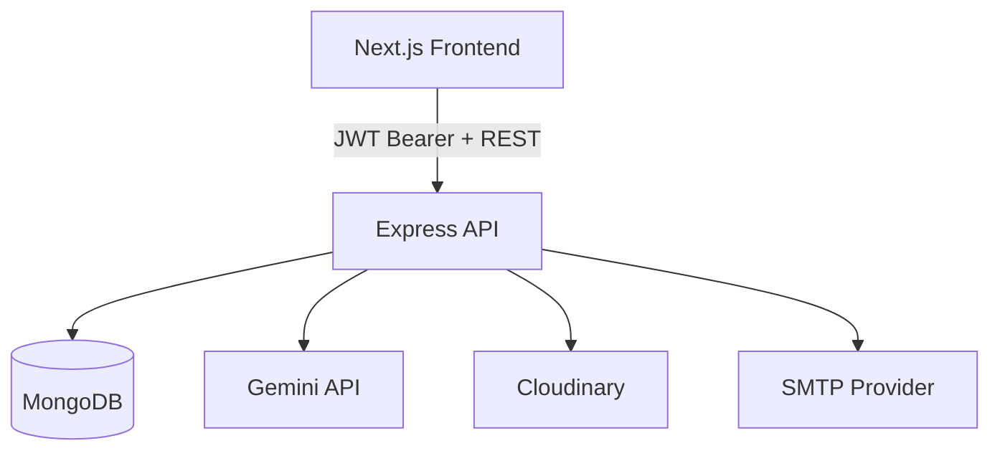

# Axios Backend Architecture (Express + MongoDB + Gemini)

Backend service for the Umurava AI Hackathon solution: an explainable AI screening engine for recruiter workflows.

---

## 1) Backend Mission

The backend is the system-of-record and decision-orchestration layer. It handles:

- identity and authorization
- company-tenant data boundaries
- job and candidate lifecycle APIs
- ingestion pipelines for CSV/Excel/PDF input
- AI evaluation orchestration with Gemini
- deterministic fallback scoring under quota constraints
- screening result persistence and explainability metadata
- shortlist communication orchestration

---

## 2) High-Level Architecture



---

## 3) Service Stack

- Node.js (CommonJS runtime)
- Express REST API
- Mongoose ODM (MongoDB)
- JWT auth
- `@google/generative-ai` (Gemini integration)
- Multer + parsers for document ingestion
- Nodemailer for outbound shortlisted-candidate messages

---

## 4) Domain Model

Primary entities:

- `User`
  - identity, verification fields, linked `company`
- `Company`
  - org profile, departments, hiring context
- `Job`
  - role definition, scoring weights, shortlist size, status
- `Candidate`
  - normalized profile linked to `job`
- `ScreeningResult`
  - per job-candidate score, rank, strengths, weaknesses, recommendation, evaluation mode

Multi-tenant guarantee is enforced by scoping all job/candidate/screening operations through the user’s company.

---

## 5) API Architecture

Major route groups:

- `/api/auth` - register/login/password/reset
- `/api/company` - onboarding setup and current-user company context
- `/api/companies` - company management endpoints (authorized)
- `/api/jobs` - job create/read/update/delete (authorized, company scoped)
- `/api/candidates` - ingestion/list/detail/delete (authorized, company scoped)
- `/api/screening` - trigger and retrieve ranking outputs
- `/api/emails` - shortlist communication
- `/api/dashboard` - company-scoped summary metrics

---

## 6) Security Model

### Authentication

- JWT required on protected endpoints
- decoded user loaded from DB and attached to request context

### Authorization

- ownership checks on each entity access path
- cross-company access denied (`403`)

### Operational Protection

- `helmet` headers enabled
- global rate limiting for `/api/*`
- centralized not-found and error handling middleware

### Onboarding Integrity

- onboarding setup endpoint enforces one-time company creation
- duplicate company setup attempts are blocked (`409`)

---

## 7) AI Screening System Design

### Objectives

- evaluate many candidates against job requirements
- rank consistently and explain outcomes
- stay resilient under quota/rate constraints

### Execution Pipeline

1. Validate requester + company ownership
2. Load job + candidates
3. Reject screening if candidate list is empty
4. Compute local baseline score for all candidates
5. Select candidate pool for Gemini refinement
6. Run Gemini in batches with cooldown controls
7. Merge AI and fallback results
8. Sort, rank, mark shortlisted
9. Persist results transactionally
10. Return recruiter-friendly output with explainability fields

### Quota and Reliability Controls

- company-level screening lock to prevent concurrent collisions
- configurable batch sizes and delay between batches
- cached result reuse when job/candidate state has not changed
- graceful local fallback when Gemini quota is unavailable
- explicit `evaluationMode` metadata to maintain transparency

---

## 8) Ingestion Design

### Structured Uploads (CSV/Excel)

- raw rows parsed locally
- AI-assisted mapping for unknown schema patterns
- normalized candidate records persisted in bulk transaction

### Resume Uploads (PDF)

- text extraction and normalization
- optional Cloudinary storage for file reference
- AI parsing into unified candidate object before persistence

---

## 9) Job Lifecycle and Data Integrity

- create: job is always bound to authenticated user’s company
- update: company ownership cannot be reassigned
- delete:
  - deletes linked candidates
  - deletes linked screening results
  - removes any orphan screening relations tied to deleted candidates

This prevents stale records and keeps dashboard/statistics accurate.

---

## 10) Environment Variables

Use `.env.example` as baseline. Required production keys:

- `PORT`
- `NODE_ENV`
- `MONGODB_URI`
- `JWT_SECRET`
- `CORS_ORIGIN`
- `GEMINI_API_KEY`

Optional but recommended:

- SMTP settings for real email dispatch
- Cloudinary settings for resume storage
- Gemini tuning knobs for pool size/batch/cooldowns

---

## 11) Local Development

```bash
npm install
npm run dev
```

Default API URL: `http://localhost:5000/api`

---

## 12) Production Deployment Guidance

Recommended topology:

- Backend: Render/Railway/Fly
- Database: MongoDB Atlas
- Frontend: Vercel

Minimum hardening actions:

- set strong `JWT_SECRET`
- set strict `CORS_ORIGIN` to deployed frontend
- avoid default credentials in SMTP/Cloudinary
- keep secrets only in platform environment config

---

## 13) Observability and Operations

Current:

- HTTP request logging in non-production
- explicit API errors with status codes

Recommended next phase:

- structured logs with request correlation IDs
- per-route latency/error metrics
- smoke tests for critical flows
- CI validation before deploy

---

## 14) Hackathon Requirement Mapping

- Gemini as mandatory LLM: implemented
- multi-candidate analysis: implemented
- ranked shortlist (top N): implemented
- clear reasoning, strengths, gaps: implemented
- recruiter final control: preserved (AI is advisory, not final authority)
- support for structured profiles + external uploads: implemented

---

## 15) Known Gaps and Future Hardening

- add automated API integration tests for auth and tenancy boundaries
- add background job queue for very large batch operations
- add RBAC model (Admin/Recruiter/Viewer) at API level if required by product roadmap
